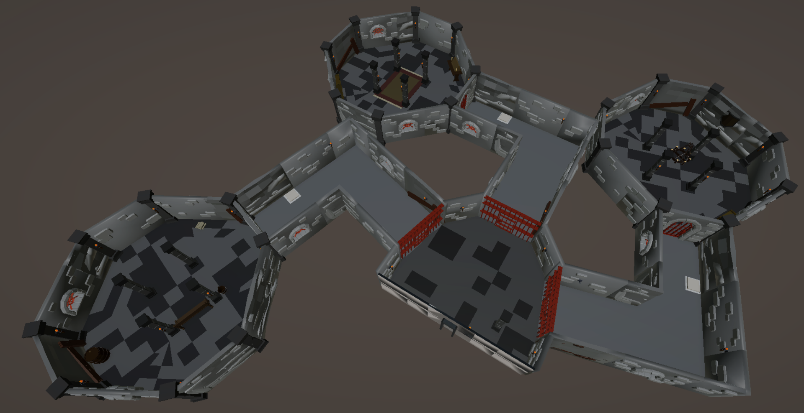
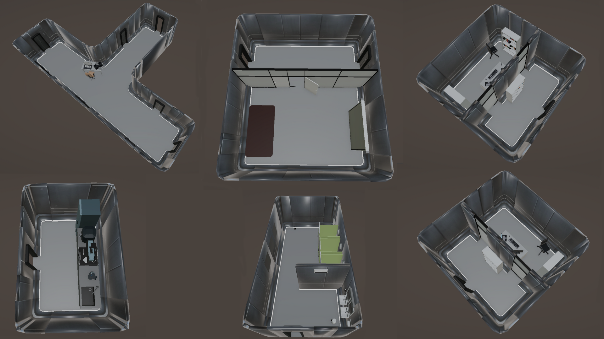

# Connecting-Minds: Konzeption und Entwicklung einer asymmetrischen AR-/3D-Multiplayer-Anwendung zur Beobachtung des Kommunikationsverhaltens zwischen Individuen

Diese Masterarbeit widmet sich der Konzeption und Entwicklung eines asymmetrischen AR-/3D-Adventure Multiplayer Anwendung zur Beobachtung und Förderung der Kommunikation zwischen Individuen. Vor dem Hintergrund zunehmender sozialer Isolation, insbesondere bei jungen Erwachsenen durch die COVID-19-Pandemie, untersucht die Arbeit, inwiefern spielerische Interaktionssysteme gezielt soziale Kommunikation anregen und verbessern können. Die Arbeit verfolgt das Ziel, ein digitales Spielsystem zu entwickeln, in dem zwei Spielerrollen (Player und Watcher) kooperativ Rätsel lösen und dabei unterschiedliche Perspektiven und Informationslagen einnehmen. Aufbauend auf kognitionswissenschaftlichen Modellen und spieltheoretischen Konzepten wurde ein funktionaler Prototyp umgesetzt, getestet und im Rahmen einer Nutzerstudie evaluiert. Die Untersuchung analysiert quantitative Veränderungen im Kommunikationsverhalten der Teilnehmenden und zeigt, dass asymmetrisches Gameplay hinreichenden Auswirkungen auf Gesprächsführung, Rollenverteilung, Empathie und Engagement haben. Die Ergebnisse deuten das Potenzial von Mixed-Plattform-Spielen zur Verbesserung zwischenmenschlicher Kommunikation an, und liefern praxisnahe Empfehlungen für zukünftige interaktive Systeme in sozialen und pädagogischen Kontexten.

## Zugang zur Arbeit

📄 [Masterarbeit lesen](./masterthesis.pdf)

## Zugang zur Präsentation

📄 [Präsentation ansehen](./präsentation.pdf)

## Vorangegangene Arbeit

Wie auch bei meiner Bachelorarbeit, gab es zu dieser Arbeit ein vorangegangenes Projekt aus einer Pflichtveranstaltung aus dem Studium. Bei dieser Arbeit ist es das Projekt aus dem Modul Interaktionsdesign aus dem Wintersemester 2023/ 2024. Der entstandene Prototyp enthielt bereits das zugrundeliegende Konzept, wenn auch auf einer sehr minimierten Ebene. Das folgende Video zeigt den erstellten Prototyp:

## Hintergründe

Während der COVID-19-Pandemie führten Maßnahmen wie Lockdowns und soziale Distanzierung zu massiver psychischer Belastung, insbesondere durch gesteigerte Einsamkeit und eingeschränkte soziale Interaktionen. Studien zeigen, dass Online-Gaming als Bewältigungsstrategie diente und dabei helfen konnte, Stress, Angst, Depressionen und Einsamkeit zu reduzieren. Insbesondere spielerische soziale Interaktionen dienten dabei als Stütze (vgl. Lewinson et al. 2023). So ergab eine systematische Übersichtarbeit, dass Online-Gaming jungen Erwachsenen weltweit als wichtiger Faktor zur sozialen Vernetzung diente, gleichzeitig aber auch Beziehungen und Empathie bei intensiver Nutzung beeinträchtigen kann (vgl. Park et al. 2025).

Auch heute leiden noch viele junge Erwachsene unter den Folgen der Lockdowns und genereller Einsamkeit (vgl. Peer & AFP 2024, Einsamkeitsreport 2024: So einsam ist Deutschland | Die Techniker - Presse & Politik 2024). Darüber hinaus zeigt sich, dass je weniger Kommunikation zwischen Individuen besteht (sei es persönlich oder per Telefon) die Einsamkeit von jungen Erwachsenen erhöht ist (vgl. Sakurai et al. 2021, S. 3). Daraus lässt sich ableiten, dass soziale Kommunikation nicht nur passiv entstehen sollte, sondern gezielt angestoßen, strukturell ermöglicht und von Spiel- und Interaktionssystemen eingefordert werden kann, um soziale Isolation präventiv zu bekämpfen.

Ein erstes Konzept zur Auseinandersetzung mit diesen Problematiken wurde im Rahmen der Veranstaltung Interaktionsdesign im ersten Mastersemester der Studiengänge Medieninformatik Master (MIM) und Design Interaktiver Medien (DIM) im Wintersemester 2023/2024 entwickelt und umgesetzt. Hinzu kommt der Aspekt, dass Co-Lokalisiertes Spielen zur Verbesserung der Kommunikation beitragen kann und daher ein Teilaspekt dieser Anwendung ist (vgl. Goddard et al. 2016, S. 9). Aufgrund der interessanten Rätselmechanik, des positiven Feedbacks bei den in der Projektausarbeitung enthaltenen Probandentests sowie des spannenden Forschungsfeldes wurde beschlossen, dieses Projekt weiterzuführen und die konzeptionellen Grundideen in eine Umsetzung zu überführen.

Der Titel des Projektes lautet “Connecting-Minds”.

## Forschungskontext

Im Bereich CSCW und HCI/CHI gibt es zahlreiche Arbeiten zu Multiplayer-Spielen, deren Einfluss auf soziale Interaktionen und zu relevanten Game-Design-Aspekten.

- Soziale Dynamiken:
    - Freundschaften steigern individuelle und Teamleistungen (Mason & Clauset, 2013).
    - In MMOs wie World of Warcraft entstehen soziale Bindungen oft erst langfristig durch Strukturen wie Gilden (Ducheneaut et al., 2006).

- Player Engagement:
    - Verschiedene Messmethoden wie EEG, Eye Tracking oder Verhaltensanalysen werden erforscht, sind aber schwer eindeutig zu validieren (Rashed et al., 2025).
    - Studien untersuchen zudem, wie Spielmechaniken aktiv Zusammenarbeit fördern können (Yu & Cardoso-Leite, 2023).

- Asymmetrisches Game Design:
    - Asymmetrische Rollenverteilungen verbessern Kooperation und ermöglichen Inklusion (Harris et al., 2014–2019; Gonçalves et al., 2021; Pais et al., 2024).
    - Kooperative Design-Pattern zeigen, dass hohe Interdependenz Kommunikation fördert und Frustration senkt (Emmerich & Masuch, 2017).

- Soziale & psychologische Effekte:
    - Vertrauen und Abhängigkeiten können durch Spiele simuliert werden (Depping et al., 2016).
    - Kooperative Spiele steigern Helferverhalten und reduzieren Aggression gegenüber Fremdgruppen (Velez et al., 2014).

- VR & neue Interfaces:
    - Zusammenarbeit wird auch in VR untersucht – Freundschaften spielten dabei teils weniger Rolle als gedacht (Karaosmanoglu et al., 2023).
    - Innovative Konzepte wie Sifteo Cubes oder VR-Anwendungen zeigen positive Effekte auf Kooperation (Sajjadi et al., 2014; Smilovitch & Lachman, 2019).

- Kommunikation & Ice-Breaking:
    - Spezielle Spiele können Interaktion anregen und die spätere Gruppenarbeit verbessern (Nasir et al., 2013/2015).
    
## Forschungsbeitrag

Diese Arbeit knüpft an die grundlegenden Untersuchungen von Nasir et al. (2013, 2015) an und erweitert deren Forschungsansatz um Vor- und Nachtest innerhalb derselben Versuchsgruppe. Ziel ist es, nachzuweisen, dass durch den Einsatz des entwickelten Prototyps gezielt eine Verbesserung der gemeinsamen Kommunikation in bestehenden Gruppen erzielt werden kann. Im Gegensatz zu einer stilisierten Anwendung mit dem Zweck des Ice-Breakings dient der entwickelte Prototyp darüber hinaus als vollwertiges Multiplayer-Spiel, das auch unabhängig vom Kontext wissenschaftlicher Experimente in der Freizeit genutzt werden kann. Ein zentrales Merkmal des Prototyps ist seine Realisierung als Cross-Plattform-Multiplayer-Spiel. Dabei kommen unterschiedliche Endgeräte zum Einsatz, um die damit verbundenen Effekte auf die Interaktion und Kommunikation der Nutzer gezielt untersuchen zu können. Im Fokus der Untersuchung steht insbesondere die Integration von AR sowie die Touchsteuerung beider Anwendungskomponenten, welche im Rahmen des Prototyps umgesetzt werden.

## Forschungsfragen

- Kann eine spielbasierte Umgebung für die Untersuchung und Verbesserung von Kommunikation zwischen zwei oder mehreren Personen realisiert werden?
- Welche spezifischen Eigenschaften muss eine solche Umgebung aufweisen und welche Kommunikationsparameter werden dabei angesprochen?
- Welche Verbesserungen in der Kommunikation zwischen den Anwendern können durch ein asymmetrisches Multiplayer-Spiel mit zwei verschiedenen Spielerklassen beobachtet werden?
- Welche Unterschiede können in der Art das Kommunikationsverhalten bei der Verwendung von zwei unterschiedlichen Anwendungen (AR und 3D) (festgestellt/beobachtet) werden?
- Wie stehen die Nutzer zu einem spielerischen Ansatz und zur Verbesserung der Kommunikation, insbesondere auch im Umgang mit Fremden?

## Methodisches Vorgehen

  

## Analyse 

|  |  |  |
|---------|---------|---------|
| Visuelle Analyse:  [Ansicht Animator](/Analyse/Myrmidon/Visual/Animator_Analysis.png)  [Ansicht Puppet](/Analyse/Myrmidon/Visual/Puppet_Analysis.png) | **We Were Here** Visuelle Analyse:  [Ansicht Explorer](/Analyse/WeWereHere/Visual/Explorer_Analysis.png)  [Ansicht Librarian](/Analyse/WeWereHere/Visual/Librarian_Analysis.png) **We Were Here Too** Visuelle Analyse:  [Ansicht Lord](/Analyse/WeWereHereToo/Visual/Lord_Analysis.png)  [Ansicht Peasant](/Analyse/WeWereHereToo/Visual/Peasant_Analysis.png) | Visuelle Analyse:  [Ansicht Spieler](/Analyse/TinyRoomStoriesTownMystery/Visual.png) |
| Analyse Rätseldesign:  [Ergebnisse](/Analyse/Myrmidon/Rätseldesign.png) | **We Were Here** Analyse Rätseldesign:  [Ergebnisse](/Analyse/WeWereHere/Rätseldesign.png) **We Were Here Too** Analyse Rätseldesign:  [Ergebnisse](/Analyse/WeWereHereToo/Rätseldesign.png) | Analyse Rätseldesign:  [Ergebnisse](/Analyse/TinyRoomStoriesTownMystery/Rätseldesign.png) |

## Konzeption anhand des MDA-Frameworks

- Mechanics (Mechaniken)

    - Player: Steuert einen Avatar per Maus oder Touch, kann zwischen isometrischer und First-Person-Perspektive wechseln, Objekte aufnehmen, tragen und platzieren. Interaktionen erfolgen über Toolbar oder First-Person-View. Neue Objekte werden durch physische Annäherung freigeschaltet.

    - Watcher: Interagiert via AR-Anwendung, bewegt sich frei um die Szene, verwaltet Inventar, platziert/entfernt Objekte und übergibt sie an den Player. Später kann er Objekte skalieren oder rotieren.

    - Weltregeln: Leichte Objekte kann der Player tragen, schwere nur der Watcher. Hinweise in Form von Texten/Bildern fördern die Kooperation und die räumliche Interaktion.

- Dynamics (Dynamiken)

    - Asymmetrische Informations- und Perspektivverteilung zwingt beide Rollen zur koordinierten Abstimmung.

    - Herausforderungen erfordern kombinierte Nutzung der jeweiligen Fähigkeiten.

    - AR-Technologie projiziert die Spielwelt in den physischen Raum des Watchers, wodurch neuartige räumliche Orientierung und immersive Interaktion entstehen.

    - Kooperation wird durch die Abhängigkeit der Rollen gefördert, ohne dass eine Rolle komplett dominiert wird.

- Aesthetics (Erfahrungen)

    - Fördert Challenge, Fellowship und Expression:

        - Logisches Denken und Problemlösung

        - Intensive Kommunikation und Abstimmung zwischen den Spielerrollen

        - Entwicklung individueller Strategien und Reflexion eigener Stärken

    - Narrative Elemente geben den Mechaniken Kontext und Motivation, steigern den Sinn und fördern ein kohärentes Spielerlebnis.

## Umsetzung

### Ansicht der Spielrrollen

<table>
    <tr>
        <td>
        Player-Anwendung
        </td>
        <td>
        Watcher-Anwendung
        </td>
    </tr>
  <tr>
    <td>
      
    </td>
    <td>
      
    </td>
  </tr>
</table>

### Erstellte Spielwelt

<table>
  <tr>
    <td>
      
    </td>
    <td>
        
    </td>
    <td>
        
    </td>
  </tr>
</table>

### Gameplay Video

<!-- https://youtu.be/kcAachdtRzo -->

Interesse geweckt?

Melde dich einfach über dieses [Kontaktformular](https://athaeck.github.io/) bei mir, um den Quellcode für den Prototyp und eine Anleitung zu erhalten!

## Quellen

Lewinson, Rebecca/Wardell, Jeffrey/Kronstein, Naama/Rapinda, Karli/Kempe, Tyler/Katz, Joel et al. (2023):Gaming as a coping strategy during the COVID-19 pandemic. In: Cyberpsychology: Journal of Psychosocial Research on Cyberspace, 2023, 17 (3).

Park, Chulwoo/Angelica, Patricia/Trisnadi, Airi Irene (2025):Global impacts of video gaming behavior on young adults’ mental health during the COVID-19 pandemic: A systematic literature review. In: Social Sciences & Humanities Open, 2025, 11, S. 101229.

Peer, Mathias/AFP (2024):Junge Menschen: Bertelsmann Stiftung sieht Einsamkeit als „politisches Problem“, 2024.

Sakurai, Ryota/Nemoto, Yuta/Mastunaga, Hiroko/Fujiwara, Yoshinori (2021):Who is mentally healthy? Mental health profiles of Japanese social networking service users with a focus on LINE, Facebook, Twitter, and Instagram. In: PLOS ONE, 2021, 16 (3), S. e0246090.

Goddard, William/Garner, Jayden/Jensen, Mads Moller (2016):Designing for social play in co-located mobile games (ACSW ’16), Proceedings of the Australasian Computer Science Week Multiconference, New York, NY, USA, S. 1–10.

Mason, Winter/Clauset, Aaron (2013):Friends FTW! friendship and competition in halo: reach, Proceedings of the 2013 conference on Computer supported cooperative work, Gehalten auf der CSCW ’13: Computer Supported Cooperative Work, San Antonio Texas USA, S. 375–386.

Ducheneaut, Nicolas/Yee, Nicholas/Nickell, Eric/Moore, Robert J. (2006):„Alone together?“: exploring the social dynamics of massively multiplayer online games, Proceedings of the SIGCHI Conference on Human Factors in Computing Systems, Gehalten auf der CHI06: CHI 2006 Conference on Human Factors in Computing Systems, Montréal Québec Canada, S. 407–416.

Rashed, Ammar/Shirmohammadi, Shervin/Amer, Ihab/Hefeeda, Mohamed (2025):A Review of Player Engagement Estimation in Video Games: Challenges and Opportunities. In: ACM Trans. Multimedia Comput. Commun. Appl., 2025.

Hainan Yu/Cardoso-Leite, Pedro (2023):Video Games to Study and Improve Collaboration Skills (CHI PLAY Companion ’23). In: Companion Proceedings of the Annual Symposium on Computer-Human Interaction in Play, 2023, S. 149–154.

Harris, John/Hancock, Mark/Scott, Stacey (2014):„beam me 'round, Scotty!“: exploring the effect of interdependence in asymmetric cooperative games (CHI PLAY ’14), Proceedings of the first ACM SIGCHI annual symposium on Computer-human interaction in play, New York, NY, USA, S. 417–418.

Harris, John/Hancock, Mark/Scott, Stacey D. (2016):Leveraging Asymmetries in Multiplayer Games: Investigating Design Elements of Interdependent Play (CHI PLAY ’16), Proceedings of the 2016 Annual Symposium on Computer-Human Interaction in Play, New York, NY, USA, S. 350–361.

Harris, John/Hancock, Mark (2019):To Asymmetry and Beyond!: Improving Social Connectedness by Increasing Designed Interdependence in Cooperative Play, Proceedings of the 2019 CHI Conference on Human Factors in Computing Systems, Gehalten auf der CHI ’19: CHI Conference on Human Factors in Computing Systems, Glasgow Scotland Uk, S. 1–12.

Gonçalves, David/Rodrigues, André/Richardson, Mike L./de Sousa, Alexandra A./Proulx, Michael J./Guerreiro, Tiago (2021):Exploring Asymmetric Roles in Mixed-Ability Gaming (CHI ’21), Proceedings of the 2021 CHI Conference on Human Factors in Computing Systems, New York, NY, USA, S. 1–14.

Pais, Pedro/Gonçalves, David/Gerling, Kathrin/Romão, Teresa/Guerreiro, Tiago/Rodrigues, André (2024):Promoting Family Play through Asymmetric Game Design. In: Proc. ACM Hum.-Comput. Interact., 2024, 8 (CSCW1), S. 115:1-115:24.

Emmerich, Katharina/Masuch, Maic (2017):The Impact of Game Patterns on Player Experience and Social Interaction in Co-Located Multiplayer Games (CHI PLAY ’17), Proceedings of the Annual Symposium on Computer-Human Interaction in Play, New York, NY, USA, S. 411–422.

Depping, Ansgar E./Mandryk, Regan L./Johanson, Colby/Bowey, Jason T./Thomson, Shelby C. (2016):Trust Me: Social Games are Better than Social Icebreakers at Building Trust, Proceedings of the 2016 Annual Symposium on Computer-Human Interaction in Play, Gehalten auf der CHI PLAY ’16: The annual symposium on Computer-Human Interaction in Play, Austin Texas USA, S. 116–129.

Velez, John A./Mahood, Chad/Ewoldsen, David R./Moyer-Gusé, Emily (2014):Ingroup Versus Outgroup Conflict in the Context of Violent Video Game Play: The Effect of Cooperation on Increased Helping and Decreased Aggression. In: Communication Research, 2014, 41 (5), S. 607–626.

Karaosmanoglu, Sukran/Schmolzi, Tom/Steinicke, Frank (2023):Playing with Friends or Strangers? The Effects of Familiarity between Players in an Asymmetric Multiplayer Virtual Reality Game (CHI PLAY Companion ’23), Companion Proceedings of the Annual Symposium on Computer-Human Interaction in Play, New York, NY, USA, S. 76–82.

Sajjadi, Pejman/Cebolledo Gutierrez, Edgar Omar/Trullemans, Sandra/De Troyer, Olga (2014):Maze commander: a collaborative asynchronous game using the oculus rift & the sifteo cubes, Proceedings of the first ACM SIGCHI annual symposium on Computer-human interaction in play, Gehalten auf der CHI PLAY ’14: The annual symposium on Computer-Human Interaction in Play, Toronto Ontario Canada, S. 227–236.

Smilovitch, Michael/Lachman, Richard (2019):BirdQuestVR: A Cross-Platform Asymmetric Communication Game (CHI PLAY ’19 Extended Abstracts), Extended Abstracts of the Annual Symposium on Computer-Human Interaction in Play Companion Extended Abstracts, New York, NY, USA, S. 307–313.

Nasir, Maaz/Lyons, Kelly/Leung, Rock/Moradian, Ali (2013):Cooperative Games and Their Effect on Group Collaboration. In: vom Brocke, Jan/Hekkala, Riitta/Ram, Sudha/Rossi, Matti (Hrsg.), Design Science at the Intersection of Physical and Virtual Design, Berlin, Heidelberg, S. 502–510.

Nasir, Maaz/Lyons, Kelly/Leung, Rock/Bailie, Anthea/Whitmarsh, Fred (2015):The effect of a collaborative game on group work (CASCON ’15), Proceedings of the 25th Annual International Conference on Computer Science and Software Engineering, USA, S. 130–139.
